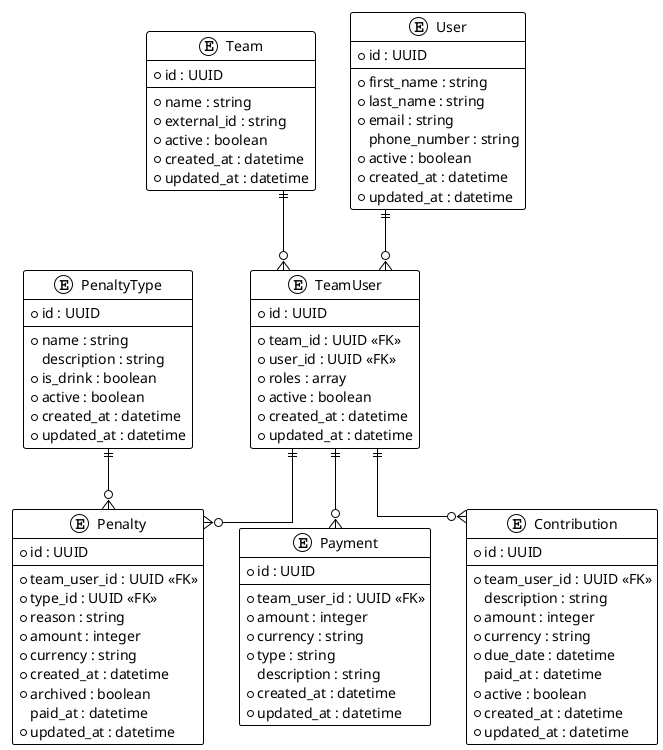

## Current Status

The project has already been initialized with the following components:

- Symfony 7.2 framework installation
- Basic project structure
- GitHub repository setup at `git@github.com:Psheikomaniac/cashbox.git`
- Docker configuration

This roadmap builds upon this existing foundation.# Project Roadmap

## Overview

This roadmap outlines the planned development phases for Cashbox. The system will be developed incrementally, with each version focusing on specific features and improvements. The project maintains a strong focus on code quality, security, and comprehensive testing throughout all phases.

## Database Schema

The system will use the following database schema, which will evolve with each version:

## Version Roadmap

### Version 1.0.0 - Foundation and Penalties Management

**Focus:** Core infrastructure, penalty/drinks management

**Release Date:** Q2 2025

**Features:**
- Basic system architecture setup
- Team and user management
- Penalty and drink tracking
- Basic API for CRUD operations
- Authentication and authorization
- Import functionality for CSV data

**Details:** [Version 1.0.0 Plan](version-1.0.0.md)

### Version 1.1.0 - User Experience and Reporting

**Focus:** User experience improvements and basic reporting

**Release Date:** Q3 2025

**Features:**
- Enhanced API for filtering and sorting
- Basic reporting functionality
- User dashboard for penalty overview
- Admin dashboard for financial oversight
- User notification system
- Export functionality for reports

**Details:** [Version 1.1.0 Plan](version-1.1.0.md)

### Version 1.2.0 - Contribution Management

**Focus:** Member contributions tracking and management

**Release Date:** Q4 2025

**Features:**
- Contribution management (dues, membership fees)
- Recurring contribution setup
- Payment tracking for contributions
- Import/export for contribution data
- Enhanced reporting for contributions

**Details:** [Version 1.2.0 Plan](version-1.2.0.md)

### Version 1.3.0 - Payment Processing

**Focus:** Payment processing and tracking

**Release Date:** Q1 2026

**Features:**
- Integration with payment gateways
- Payment history and receipts
- Refund processing
- Payment reminders
- Financial reporting improvements

**Details:** [Version 1.3.0 Plan](version-1.3.0.md)

### Version 2.0.0 - Advanced Features and Integration

**Focus:** Advanced features and third-party integrations

**Release Date:** Q2 2026

**Features:**
- Mobile app integration
- Advanced analytics and reporting
- Integration with accounting software
- Bulk operations for penalties and payments
- Team financial planning tools
- Multi-team management for organizations

**Details:** [Version 2.0.0 Plan](version-2.0.0.md)

## Feature Brainstorming

### Future Feature Ideas

1. **Multi-Currency Support**
   - Support for different currencies
   - Automatic currency conversion
   - Regional tax calculations

2. **Budget Planning**
   - Team budget creation and tracking
   - Budget vs. actual reporting
   - Financial forecasting

3. **Event-Based Finances**
   - Track finances for specific events
   - Event-specific penalty types
   - Event budgeting and reporting

4. **Expense Tracking**
   - Team expense tracking
   - Receipt upload and management
   - Expense approval workflow
   - Reimbursement tracking

5. **Advanced User Roles**
   - Role-based access control
   - Custom permission sets
   - Delegation capabilities

6. **Audit System**
   - Complete audit trail of financial activities
   - Compliance reporting
   - Data export for external audits

7. **Subscription Management**
   - Recurring payment management
   - Subscription tracking
   - Automatic renewal notices

8. **Inventory Management**
   - Drink inventory tracking
   - Automated inventory alerts
   - Inventory valuation

9. **Team Communication**
   - In-app messaging
   - Announcement system
   - Financial notification preferences

10. **Advanced Analytics**
    - Financial trend analysis
    - User behavior analytics
    - Predictive financial modeling
    - Custom report builder

11. **Smart Recommendations**
    - Penalty trend detection
    - Financial health indicators
    - Budget optimization suggestions

12. **Third-Party Integrations**
    - Calendar integrations (Google, Outlook)
    - Accounting software integration
    - Banking integration
    - Team management software integration

## Development Priorities

The development priorities are guided by the following principles:

1. **Core Functionality First**: Develop essential features before moving to advanced capabilities
2. **User Value**: Prioritize features that deliver immediate value to users
3. **Incremental Delivery**: Release useful functionality early and often
4. **Technical Foundation**: Ensure a solid foundation for future development
5. **Feedback Integration**: Incorporate user feedback in future versions

## Evaluation Metrics

Success of each version will be evaluated based on:

1. Feature completeness
2. Code quality (as measured by static analysis tools)
3. Test coverage (minimum 90% for core functionality)
4. Performance metrics
5. Security assessment results
6. API responsiveness
7. User feedback
8. Documentation quality

For detailed information on code quality standards, security practices, testing methodologies, and enum usage, see the following documents:
- [Static Analysis and Code Quality Guidelines](static_analysis.md)
- [Security Guidelines](security.md)
- [Testing Guidelines](testing.md)
- [PHP Enums Best Practices](enum_best_practices.md)
- [Composer Dependency Guidelines](composer_guidelines.md)

## Revision Process

This roadmap is a living document that will be reviewed and updated:

- At the end of each development cycle
- When significant user feedback is received
- When business requirements change
- When new technologies emerge that could benefit the project